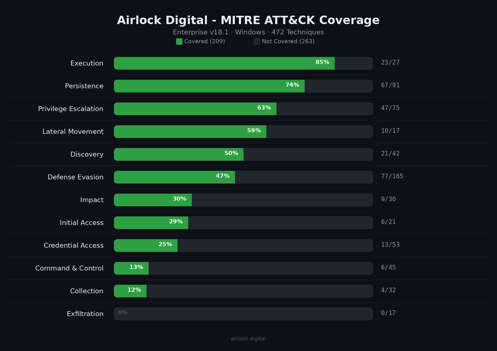

# Mapping Airlock Digital Against the MITRE ATT&CK Framework

>**Author:** Rob Shiplo - Sr Research Engineer - Systems & Endpoint Security @ Airlock Digital
>
>**Published:** March 2026 | **Platform:** Windows | **ATT&CK Version:** Enterprise v18.1

---

## TL;DR

I mapped Airlock Digital's enforcement model against every Windows-applicable technique in the MITRE ATT&CK Enterprise framework - 472 techniques and sub-techniques, scored with a binary Yes/No model. No hedging, no inflated numbers. The result: Airlock directly controls an execution point in **199 techniques (42%)** overall.

But not all ATT&CK tactics are execution control problems. When scoped to the tactics where execution control is actually the right tool for the job - Execution, Persistence, Privilege Escalation, Defense Evasion, Lateral Movement, and Impact - Airlock covers **55% (226 of 405 techniques)**. The remaining uncovered tactics are predominantly network-level (C2, Exfiltration) and identity-plane operations (Credential Access, Collection) that no allowlisting product would address.



This post walks through the methodology, the results, and what it actually means for defenders building layered security architectures.

---

## Why I Did This

Large customers ask a reasonable question: *"Where does Airlock fit in the ATT&CK matrix?"*

Most vendors answer this with a heatmap that looks impressively green. I wanted to answer it honestly. Application allowlisting is execution control - it's not EDR, it's not a SIEM, it's not identity protection. It does one thing extremely well: controlling what is allowed to execute on an endpoint. The ATT&CK mapping should reflect exactly that - where Airlock's enforcement model intersects an attacker's execution chain, and where it doesn't.

I also wanted every "Yes" to come with a concrete answer: which Airlock control applies, and how you'd prove it in a lab.

---

## Methodology

### Scope

- **Platform:** Windows only. Airlock's Windows agent uses a kernel driver for authoritative allow/block decisions at file load time, with the bulk of policy logic in user mode. This is the most mature enforcement model and the one most customers deploy at scale.
- **Framework version:** MITRE ATT&CK Enterprise v18.1
- **Techniques evaluated:** 472 (all Windows-applicable techniques and sub-techniques)

### Scoring Model

I used a binary scoring model - **Yes** or **No** - because security architecture decisions are binary. When a customer asks "does Airlock cover this technique?", the answer should be concrete.

**Yes** means Airlock's enforcement model directly controls an execution point in the technique's attack chain. The untrusted payload, binary, DLL, script, or driver IS blocked. Each "Yes" includes:

- The specific enforcement mechanism (default-deny, script control, DLL control, blocklist metarule, browser extension control, or agent tamper protection)
- A test case describing how to validate coverage in a lab
- Known limitations where the control has boundaries

**No** means the technique doesn't involve file, script, or DLL execution that Airlock controls, and there is no specific binary that can be practically blocklisted to prevent it. These are typically network-level operations, identity-plane activity, in-memory manipulation, or pure API calls within already-trusted processes.

### What Counts as "Covered"

A technique is scored "Yes" if Airlock blocks execution at any point in the technique's attack chain. This includes scenarios where the trigger mechanism succeeds but the payload is blocked. For example:

- **Scheduled Task (T1053.005):** The attacker can create the scheduled task. When the task fires, the untrusted payload is blocked. This is a Yes - Airlock controls the execution point that matters.
- **Registry Run Keys (T1547.001):** The attacker can write the registry key. At next logon, the untrusted binary it points to is blocked. Yes.
- **Service Execution (T1569.002):** PsExec copies its service binary to the remote host. The binary is blocked on the target. Yes.

A technique is also scored "Yes" if a specific identifiable binary can be **safely** restricted via Airlock's blocklist metarule engine - meaning the tool can be blocklisted for non-admin users without breaking standard Windows operations. For example:

- **Clear Windows Event Logs (T1070.001):** `wevtutil.exe` is a trusted OS binary that standard users never need. Blocklist metarule: original filename "wevtutil" AND user NOT member of Administrators. Yes.
- **Inhibit System Recovery (T1490):** `vssadmin.exe` and `bcdedit.exe` - critical ransomware precursor tools that standard users never need - can be safely blocklisted for non-admin users. Yes.
- **OS Credential Dumping (T1003):** Standalone tools like mimikatz are blocked by default-deny. Built-in tools like `procdump.exe` can be blocklisted by original filename.

Conversely, a technique is scored "No" if the only path to coverage would require blocklisting a core Windows utility that standard users depend on (like `net.exe` for drive mapping, or `reg.exe` used by installers and Group Policy processing).

---

## Results

### Overall Coverage

| | Count | Percentage |
|:---|---:|---:|
| **Covered (Yes)** | 199 | 42% |
| **Not Covered (No)** | 273 | 58% |
| **Total** | 472 | 100% |

### Coverage by Tactic

| Tactic | Yes | No | Total | Coverage |
|:-------|----:|---:|------:|---------:|
| Execution | 23 | 4 | 27 | 85% |
| Persistence | 63 | 28 | 91 | 69% |
| Privilege Escalation | 46 | 29 | 75 | 61% |
| Lateral Movement | 10 | 7 | 17 | 58% |
| Defense Evasion | 75 | 90 | 165 | 45% |
| Discovery | 16 | 26 | 42 | 38% |
| Impact | 9 | 21 | 30 | 30% |
| Initial Access | 6 | 15 | 21 | 28% |
| Credential Access | 13 | 40 | 53 | 24% |
| Command and Control | 6 | 39 | 45 | 13% |
| Collection | 4 | 28 | 32 | 12% |
| Exfiltration | 0 | 17 | 17 | 0% |

---

## Where Airlock Is Strongest

### Execution (85% covered)

This is Airlock's home turf. Script control covers all major scripting interpreters - PowerShell, cmd/batch, VBScript, JavaScript, Python, AutoIT, Lua - with SHA-256 hashing at execution time. DLL control catches malicious libraries at load time. The only execution techniques Airlock doesn't cover are Native API calls inside already-running processes (T1106), IPC between trusted processes (T1559), input injection (T1674), and exploitation for client execution (T1203) - all of which operate within trusted process context where no new file execution occurs, or involve exploiting a vulnerability rather than executing a file.

### Persistence (69% covered)

Attackers establish persistence by registering something to execute later - a registry key pointing to a binary, a service configured to load a DLL, a scheduled task with a payload. Airlock doesn't prevent the registration, but it blocks the payload when it fires. Every DLL-loading persistence mechanism (Winlogon helpers, AppInit DLLs, AppCert DLLs, LSA extensions, port monitors, print processors, COM hijacking, netsh helpers) is directly controlled by DLL allowlisting.

### Defense Evasion (45% covered)

This is the largest tactic at 165 techniques, and it's where Airlock's strengths are most distinct from traditional security tools. Default-deny is inherently resistant to evasion techniques that defeat signature-based detection:

- **Obfuscation, packing, polymorphism:** Every variant has a unique hash that isn't in the allowlist. Blocked every time. This is a fundamental advantage over antivirus signatures.
- **Masquerading:** Airlock checks the SHA-256 hash of file content, not the filename. Renaming malware doesn't help. The blocklist metarule engine's original filename field catches renamed trusted tools.
- **LOLBIN proxy execution:** MSBuild, mshta, InstallUtil, CMSTP, odbcconf - all safely blocklistable via predefined blocklist packages mapped to the LOLBAS project and MITRE ATT&CK techniques. For LOLBINs that can't be safely blocklisted (regsvr32, rundll32), DLL control blocks any untrusted DLL they attempt to load.
- **DLL hijacking:** Search order hijacking, sideloading, COR_PROFILER injection - the untrusted DLL is blocked at load regardless of how it got there.

The 90 "No" techniques in defense evasion are predominantly in-memory operations (process injection family), identity-level techniques (valid accounts, token manipulation), and pre-OS boot (firmware, bootkit).

### Lateral Movement (58% covered)

When an attacker moves laterally, they typically need to execute tools on the target. PsExec's service binary must be trusted on the target (and is covered by predefined blocklist rules). Tools copied via SMB admin shares must be trusted to execute. WinRM commands launching untrusted binaries are blocked. The pattern is consistent: the movement mechanism may succeed, but the execution on the remote host is controlled.

---

## Where Airlock Has No Role (By Design)

These are not gaps - they're scope boundaries. Airlock is execution control, not a replacement for the entire security stack.

### Exfiltration (0% covered)

Every exfiltration technique operates at the network layer - transferring data over C2 channels, alternative protocols, web services, physical media. No file execution is involved. This is network security, DLP, and CASB territory.

### Command and Control (87% not covered)

C2 is network protocol behavior - encoding, encryption, proxy chains, DNS tunneling. Airlock covers the 6 techniques that involve file execution: ingress tool transfer (downloaded tools must be trusted), remote access tools (must be allowlisted), and tunneling/proxy tools (must be trusted to run).

### Credential Access (76% not covered)

Most credential access techniques are identity-plane operations: Kerberos ticket manipulation, brute force, credential store access, MFA interception. The 13 covered techniques are where standalone attacker tools (mimikatz, procdump, SharpHound) are blocked by default-deny. Note: some credential techniques are achievable with core Windows utilities (`reg.exe` for SAM export, `rundll32.exe` for comsvcs.dll MiniDump) that cannot be practically blocklisted without breaking system operations. Credential Guard is the complementary control for LSASS protection.

### Process Injection (all sub-techniques not covered)

Process injection operates entirely within trusted process memory - writing shellcode, hijacking threads, hollowing processes. There is no file on disk to hash. This is explicitly EDR and memory protection territory. Airlock's role in the kill chain is preventing the attacker from getting their injection tool onto the endpoint in the first place.

---

## The Blocklist Metarule Engine

One of the most impactful capabilities in the mapping is the blocklist metarule engine. Beyond blocking known-bad hashes, the metarule engine allows conditional restrictions on trusted, Microsoft-signed operating system utilities using criteria like original filename and Active Directory group membership.

This is what moves techniques from "not covered" to "covered." A practical example:

**PowerShell restriction for non-administrators:**

```
Criteria:  Original filename contains "powershell"
           AND user is NOT a member of Built-in Administrators
Result:    Standard users cannot launch PowerShell.
           Administrators retain access for legitimate operations.
```

### What Can Be Safely Blocklisted

Not all built-in Windows utilities can be practically blocklisted. The following classification is critical for honest coverage claims:

**Safe to blocklist for non-admins** (standard users don't need these - blocking them won't break Windows):

| Category | Tools |
|:---------|:------|
| LOLBINs (on Microsoft's own recommended block list) | mshta, cmstp, installutil, msbuild, regsvcs, regasm, odbcconf, mavinject |
| Compilers | csc.exe, vbc.exe, jsc.exe |
| Discovery/admin utilities | whoami, tasklist, systeminfo, netstat, ipconfig, nltest, dsquery, gpresult, pktmon |
| Ransomware precursor tools | vssadmin, bcdedit, wbadmin |
| Download/decode tools | certutil, bitsadmin |
| Logging utilities | wevtutil, auditpol |
| Other | shutdown, format, cipher, icacls, takeown, netsh, PowerShell, wmic |

**Cannot be practically blocklisted** (too deeply integrated into Windows - blocking breaks system operations):

| Tool | Why It Can't Be Blocked |
|:-----|:-----------------------|
| net.exe | Used by standard users for drive mapping, printer connections, and domain operations |
| reg.exe / regedit.exe | Used by installers, Group Policy processing, and Windows Update |
| sc.exe | Used by installers, SCCM, and Windows service management |
| regsvr32.exe | Used by installers, Office, and Windows Update for COM registration |
| rundll32.exe | Used by Control Panel, shell extensions, print dialogs, and system operations |
| msiexec.exe | Used by ALL MSI-based installations including Windows patches |

For techniques involving tools that can't be blocklisted, Airlock's defense is at the **payload level** - DLL control blocks what regsvr32/rundll32 try to load, script control blocks untrusted MSI files msiexec tries to install, and default-deny blocks any untrusted binary regardless of what spawned it.

Airlock ships predefined blocklist packages for Microsoft Recommended Block Rules, Microsoft Recommended Driver Block Rules, and LOLBAS-mapped packages that customers can import and deploy after an audit period.

---

## How To Use This Mapping

### For Security Architects

The accompanying CSV and ATT&CK Navigator layer provide technique-level detail. Load the Navigator JSON into [MITRE ATT&CK Navigator](https://mitre-attack.github.io/attack-navigator/) to visualize coverage. Overlay it with your EDR, SIEM, and identity protection layers to identify gaps and redundancies.

### For Detection Engineers

Every "Yes" technique includes a test case. These are reproducible validation scenarios - drop an unsigned binary, configure a blocklist metarule, fire a scheduled task - that confirm enforcement in your environment. Use them during deployment validation and periodic control testing.

### For Security Operations

The "No" techniques tell you what to monitor. Process injection, in-memory execution, credential access via trusted tools - these need behavioral detection from your EDR. Airlock's external logging (Syslog, Splunk, Graylog, CEF) provides file execution telemetry that complements EDR behavioral data.

---

## Defense-in-Depth Positioning

Allowlisting eliminates the attacker's ability to run new tools. Once attackers are forced into memory-only techniques, they become noisier and more detectable. The recommended pairing:

| Layer | What It Covers | Complements Airlock For |
|:------|:---------------|:-----------------------|
| **Airlock Digital** | Execution control - binaries, scripts, DLLs, drivers, browser extensions | Everything that touches disk |
| **EDR** | Behavioral detection, memory protection, process monitoring | In-memory injection, API abuse, behavioral anomalies |
| **Credential Protection** | LSASS hardening, Credential Guard, PAM | Credential theft via trusted tools |
| **Identity & Access** | MFA, conditional access, least privilege | Account compromise, lateral movement access |
| **Network Security** | Firewall, proxy, NDR, DNS filtering | C2 channels, exfiltration, network-based attacks |

---

*This mapping represents Airlock Digital's enforcement model as of v6.1.x on Windows, with enforcement mode active, script control enabled for all script types, DLL/library control enabled, and browser extension control enabled. Individual coverage depends on policy configuration - particularly publisher trust scope, path rule breadth, and blocklist rule deployment. Customers are encouraged to validate coverage using the provided test cases in their own environments.*
